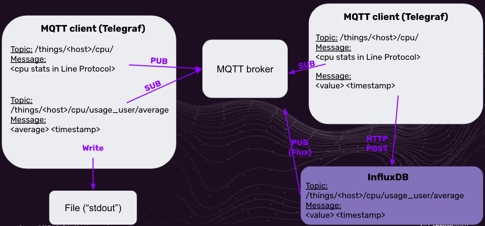
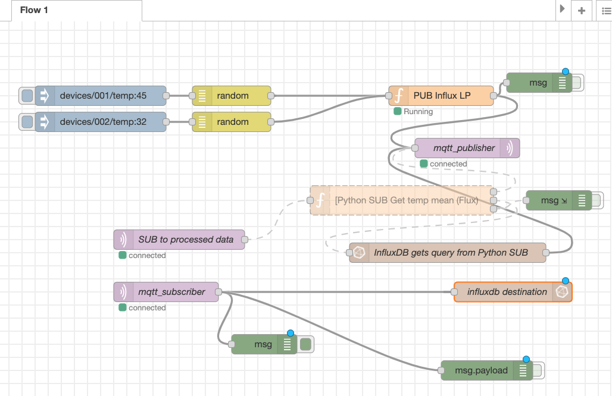

# mqtt_sandbox

## Usage
Before running, set environment variables for your Docker host machine:
- `INFLUX_ORG`
    - Maps to `DOCKER_INFLUXDB_INIT_ORG` environment variable in `influxd` container
    - The organization name (can be whatever you want)
- `INFLUX_HOST`
    - Maps to `DOCKER_INFLUX_INIT_HOST`
    - Best to set this to `http://host.docker.internal:8086`
- `INFLUX_BUCKET`
    - Maps to `DOCKER_INFLUXDB_INIT_BUCKET`
    - Whatever you want
- `INFLUX_USERNAME`
    - Maps to `DOCKER_INFLUXDB_INIT_USERNAME`
    - Username for logging into InfluxDB
- `INFLUX_PASSWORD`
    - Maps to `DOCKER_INFLUXDB_INIT_PASSWORD`
    - Password for logging into InfluxDB
- `INFLUX_TOKEN`
    - Maps to `DOCKER_INFLUXDB_INIT_ADMIN_TOKEN`
    - Token for InfluxDB admin authorization (the `influx_cli` container will need this)
- `INFLUXDB_V2_DATA_PATH`
    - Set your own path to a volume on your host machine

Next, make sure you're in the directory with the `docker-compose.yml` file contained in the repo.  Then run `docker-compose up -d`

From there you can take your browser to the following ports on `localhost`:
- :8086
    - This is the InfluxDB UI
    - Log in with the username and password you set in your environment variables
- :8080
    - This is the HiveMQ UI
    - Log in with their defaults (username=`admin`, password=`hivemq`)
- :1880
    - This is Node-Red
    
    - There is a Flow aready created for you. However, you'll need to "load" it grab your InfluxDB Token.  To load it:
        - copy the `node-red.json` text in the root of the repo
        - navigate in the UI to the "hamburger" in the upper-right and click "Import"
        - with "Clipboard" selected, paste in the JSON, make sure "current flow" is selected at the bottom, and "Import"
    - From here, double click the "_influxdb destination_" node, click the pencil icon to the right of "Server" to edit its settings and enter your Token into the "Token" field, and Update, and Done.

